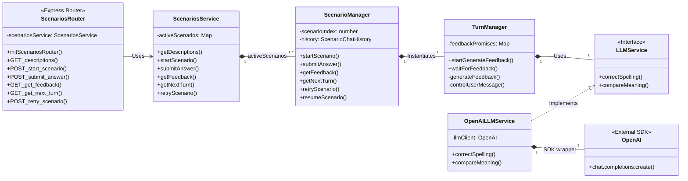

### Overview classes

```mermaid
classDiagram
    direction LR

    %% --- Controllers & Routers ---
    class ScenariosRouter {
        <<Express Router>>
        -scenariosService: ScenariosService
        +initScenariosRouter()
        +GET_descriptions()
        +POST_start_scenario()
        +POST_submit_answer()
        +GET_get_feedback()
        +GET_get_next_turn()
        +POST_retry_scenario()
    }

    %% --- Services & Managers ---
    class ScenariosService {
        -activeScenarios: Map
        +getDescriptions()
        +startScenario()
        +submitAnswer()
        +getFeedback()
        +getNextTurn()
        +retryScenario()
    }

    class ScenarioManager {
        -scenarioIndex: number
        -history: ScenarioChatHistory
        +startScenario()
        +submitAnswer()
        +getFeedback()
        +getNextTurn()
        +retryScenario()
        +resumeScenario()
    }

    class TurnManager {
        -feedbackPromises: Map
        +startGenerateFeedback()
        +waitForFeedback()
        -generateFeedback()
        -controlUserMessage()
    }

    %% --- AI & External Services ---
    class LLMService {
        <<Interface>>
        +correctSpelling()
        +compareMeaning()
    }

    class OpenAILLMService {
        -llmClient: OpenAI
        +correctSpelling()
        +compareMeaning()
    }

    class OpenAI {
        <<External SDK>>
        +chat.completions.create()
    }

    %% ==========================================
    %% RELATIONER
    %% ==========================================
    
    %% Flöde från Router -> Service -> Managers -> AI
    ScenariosRouter --> ScenariosService : Uses
    ScenariosService "1" *-- "0..*" ScenarioManager : activeScenarios
    ScenarioManager "1" *-- "1" TurnManager : Instantiates
    TurnManager "1" *-- "1" LLMService : Uses
    OpenAILLMService ..|> LLMService : Implements
    OpenAILLMService "1" *-- "1" OpenAI : SDK wrapper
    
```