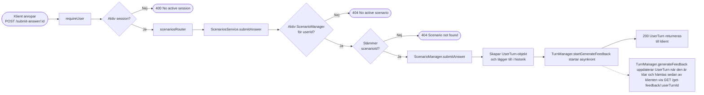

```mermaid
    flowchart LR
        O[TurnManager.generateFeedback]
        O --> P[Hämtar förväntat svar\nfrån scenarioIndex]
        P --> Q[controlUserMessage]
        Q --> R[parseMessage]
        R --> S[controlOpening]
        S --> T{Behövs\nstavningskontroll?}
        T -- Ja --> U[OpenAILLMService\n.correctSpelling]
        T -- Nej --> V[controlContent]
        U --> V
        V --> W{Behövs\nbetydelsejämförelse?}
        W -- Ja --> X[OpenAILLMService\n.compareMeaning]
        W -- Nej --> Y[controlEnding]
        X --> Y
        Y --> Z[Räknar ihop errorCounter]
        Z --> AA[Sätter AnswerAccuracy\nCorrect / PartiallyCorrect / Incorrect]
        AA --> AB[Promise löses med\nUserTurn + feedback]
    end
```