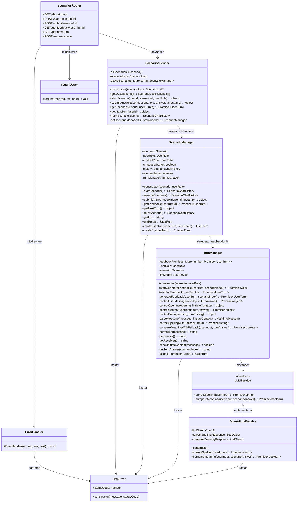

```mermaid
classDiagram
    class scenariosRouter {
        +GET /descriptions
        +POST /start-scenario/:id
        +POST /submit-answer/:id
        +GET /get-feedback/:userTurnId
        +GET /get-next-turn
        +POST /retry-scenario
    }

    class ScenariosService {
        -allScenarios: Scenario[]
        -scenarioLists: ScenarioList[]
        -activeScenarios: Map~string, ScenarioManager~
        +constructor(scenarioLists: ScenarioList[])
        +getDescriptions(): ScenarioDescriptionList[]
        +startScenario(userId, scenarioId, userRole): object
        +submitAnswer(userId, scenarioId, answer, timestamp): object
        +getFeedback(userId, userTurnId): Promise~UserTurn~
        +getNextTurn(userId): object
        +retryScenario(userId): ScenarioChatHistory
        -getScenarioManagerOrThrow(userId): ScenarioManager
    }

    class ScenarioManager {
        -scenario: Scenario
        -userRole: UserRole
        -chatbotRole: UserRole
        -chatbotIsStarter: boolean
        -history: ScenarioChatHistory
        -scenarioIndex: number
        -turnManager: TurnManager
        +constructor(scenario, userRole)
        +startScenario(): ScenarioChatHistory
        +resumeScenario(): ScenarioChatHistory
        +submitAnswer(userAnswer, timestamp): object
        +getFeedback(userTurnId): Promise~UserTurn~
        +getNextTurn(): object
        +retryScenario(): ScenarioChatHistory
        +getId(): string
        +getRole(): UserRole
        -createUserTurn(userTurn, timestamp): UserTurn
        -createChatbotTurn(): ChatbotTurn[]
    }

    class TurnManager {
        -feedbackPromises: Map~number, Promise~UserTurn~~
        -userRole: UserRole
        -scenario: Scenario
        -llmModel: LLMService
        +constructor(scenario, userRole)
        +startGenerateFeedback(userTurn, scenarioIndex): Promise~void~
        +waitForFeedback(userTurnId): Promise~UserTurn~
        -generateFeedback(userTurn, scenarioIndex): Promise~UserTurn~
        -controlUserMessage(userInput, turnAnswer): Promise~object~
        -controlOpening(opening, initiateContact): object
        -controlContent(userInput, turnAnswer): Promise~object~
        -controlEnding(ending, turnEnding): object
        -parseMessage(message, initiateContact): MaritimeMessage
        -correctSpellingWithFallback(input): Promise~string~
        -compareMeaningWithFallback(userInput, turnAnswer): Promise~boolean~
        -normalize(message): string
        -getSender(): string
        -getReceiver(): string
        -checkInitiateContact(message): boolean
        -getTurnAnswer(scenarioIndex): string
        -fallbackTurn(userTurnId): UserTurn
    }

    class OpenAILLMService {
        -llmClient: OpenAI
        -correctSpellingResponse: ZodObject
        -compareMeaningResponse: ZodObject
        +constructor()
        +correctSpelling(userInput): Promise~string~
        +compareMeaning(userInput, scenarioAnswer): Promise~boolean~
    }

    class LLMService {
        <<interface>>
        +correctSpelling(userInput): Promise~string~
        +compareMeaning(userInput, scenarioAnswer): Promise~boolean~
    }

    class HttpError {
        +statusCode: number
        +constructor(message, statusCode)
    }

    class ErrorHandler {
        +ErrorHandler(err, req, res, next): void
    }

    class requireUser {
        +requireUser(req, res, next): void
    }

    scenariosRouter --> ScenariosService : använder
    scenariosRouter --> requireUser : middleware
    scenariosRouter --> ErrorHandler : middleware
    ScenariosService --> ScenarioManager : skapar och hanterar
    ScenarioManager --> TurnManager : delegerar feedbacklogik
    TurnManager --> LLMService : använder
    LLMService <|.. OpenAILLMService : implementerar
    ErrorHandler --> HttpError : hanterar
    ScenariosService --> HttpError : kastar
    ScenarioManager --> HttpError : kastar
    TurnManager --> HttpError : kastar
    OpenAILLMService --> HttpError : kastar
```