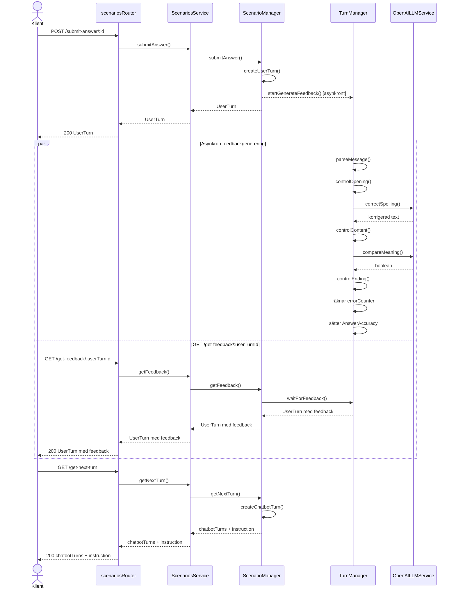

```mermaid
sequenceDiagram
    actor U as Klient
    participant R as scenariosRouter
    participant S as ScenariosService
    participant SM as ScenarioManager
    participant TM as TurnManager
    participant LLM as OpenAILLMService

    U->>R: POST /submit-answer/:id

    R->>S: submitAnswer()
    S->>SM: submitAnswer()
    SM->>SM: createUserTurn()
    SM-->>TM: startGenerateFeedback() [asynkront]
    SM-->>S: UserTurn
    S-->>R: UserTurn
    R-->>U: 200 UserTurn

    par Asynkron feedbackgenerering
        TM->>TM: parseMessage()
        TM->>TM: controlOpening()
        TM->>LLM: correctSpelling()
        LLM-->>TM: korrigerad text
        TM->>TM: controlContent()
        TM->>LLM: compareMeaning()
        LLM-->>TM: boolean
        TM->>TM: controlEnding()
        TM->>TM: räknar errorCounter
        TM->>TM: sätter AnswerAccuracy
    and GET /get-feedback/:userTurnId
        U->>R: GET /get-feedback/:userTurnId
        R->>S: getFeedback()
        S->>SM: getFeedback()
        SM->>TM: waitForFeedback()
        TM-->>SM: UserTurn med feedback
        SM-->>S: UserTurn med feedback
        S-->>R: UserTurn med feedback
        R-->>U: 200 UserTurn med feedback
    end

    U->>R: GET /get-next-turn
    R->>S: getNextTurn()
    S->>SM: getNextTurn()
    SM->>SM: createChatbotTurn()
    SM-->>S: chatbotTurns + instruction
    S-->>R: chatbotTurns + instruction
    R-->>U: 200 chatbotTurns + instruction
```
