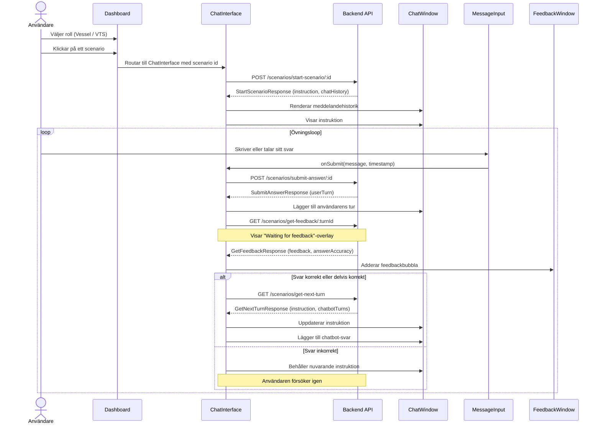

```mermaid
sequenceDiagram
    actor U as Användare
    participant D as Dashboard
    participant CI as ChatInterface
    participant API as Backend API
    participant CW as ChatWindow
    participant MI as MessageInput
    participant FW as FeedbackWindow


    U->>D: Väljer roll (Vessel / VTS)
    U->>D: Klickar på ett scenario

    D ->> CI: Routar till ChatInterface med scenario id
    CI->>API: POST /scenarios/start-scenario/:id
    API-->>CI: StartScenarioResponse (instruction, chatHistory)

    CI->>CW: Renderar meddelandehistorik
    CI->>CW: Visar instruktion

    loop Övningsloop
        U->>MI: Skriver eller talar sitt svar
        MI->>CI: onSubmit(message, timestamp)

        CI->>API: POST /scenarios/submit-answer/:id
        API-->>CI: SubmitAnswerResponse (userTurn)
        CI->>CW: Lägger till användarens tur

        CI->>API: GET /scenarios/get-feedback/:turnId
        Note over CI,API: Visar "Waiting for feedback"-overlay
        API-->>CI: GetFeedbackResponse (feedback, answerAccuracy)
        CI->>FW: Adderar feedbackbubbla

        alt Svar korrekt eller delvis korrekt
            CI->>API: GET /scenarios/get-next-turn
            API-->>CI: GetNextTurnResponse (instruction, chatbotTurns)
            CI->>CW: Uppdaterar instruktion
            CI->>CW: Lägger till chatbot-svar
        else Svar inkorrekt
            CI->>CW: Behåller nuvarande instruktion
            Note over CI,API: Användaren försöker igen
        end
    end
```