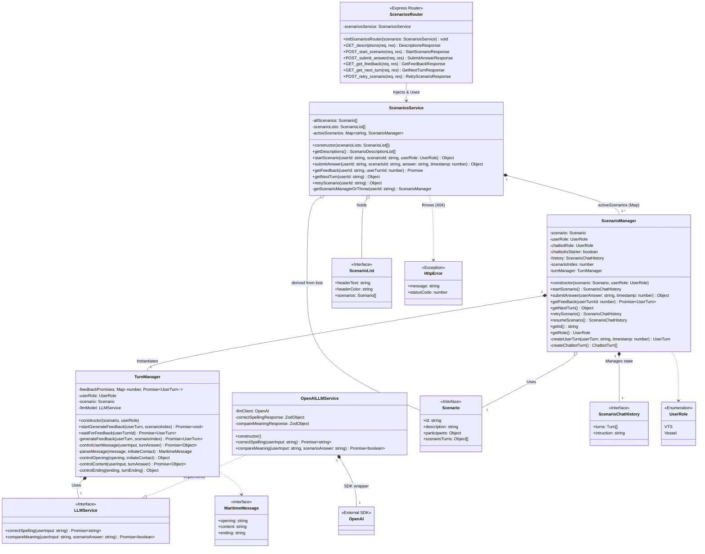

```mermaid
classDiagram
    direction TB
    %% --- Controllers & Routers ---
    class ScenariosRouter {
        <<Express Router>>
        -scenariosService: ScenariosService
        +initScenariosRouter(scenarios: ScenariosService) void
        +GET_descriptions(req, res) DescriptionsResponse
        +POST_start_scenario(req, res) StartScenarioResponse
        +POST_submit_answer(req, res) SubmitAnswerResponse
        +GET_get_feedback(req, res) GetFeedbackResponse
        +GET_get_next_turn(req, res) GetNextTurnResponse
        +POST_retry_scenario(req, res) RetryScenarioResponse
    }

    %% --- Services & Managers ---
    class ScenariosService {
        -allScenarios: Scenario[]
        -scenarioLists: ScenarioList[]
        -activeScenarios: Map~string, ScenarioManager~
        
        +constructor(scenarioLists: ScenarioList[])
        +getDescriptions() ScenarioDescriptionList[]
        +startScenario(userId: string, scenarioId: string, userRole: UserRole) Object
        +submitAnswer(userId: string, scenarioId: string, answer: string, timestamp: number) Object
        +getFeedback(userId: string, userTurnId: number) Promise
        +getNextTurn(userId: string) Object
        +retryScenario(userId: string) Object
        -getScenarioManagerOrThrow(userId: string) ScenarioManager
    }

    class ScenarioManager {
        -scenario: Scenario
        -userRole: UserRole
        -chatbotRole: UserRole
        -chatbotIsStarter: boolean
        -history: ScenarioChatHistory
        -scenarioIndex: number
        -turnManager: TurnManager

        +constructor(scenario: Scenario, userRole: UserRole)
        +startScenario() ScenarioChatHistory
        +submitAnswer(userAnswer: string, timestamp: number) Object
        +getFeedback(userTurnId: number) Promise~UserTurn~
        +getNextTurn() Object
        +retryScenario() ScenarioChatHistory
        +resumeScenario() ScenarioChatHistory
        +getId() string
        +getRole() UserRole
        -createUserTurn(userTurn: string, timestamp: number) UserTurn
        -createChatbotTurn() ChatbotTurn[]
    }

    class TurnManager {
        -feedbackPromises: Map~number, Promise~UserTurn~~
        -userRole: UserRole
        -scenario: Scenario
        -llmModel: LLMService
        +constructor(scenario, userRole)
        +startGenerateFeedback(userTurn, scenarioIndex) Promise~void~
        +waitForFeedback(userTurnId) Promise~UserTurn~
        -generateFeedback(userTurn, scenarioIndex) Promise~UserTurn~
        -controlUserMessage(userInput, turnAnswer) Promise~Object~
        -parseMessage(message, initiateContact) MaritimeMessage
        -controlOpening(opening, initiateContact) Object
        -controlContent(userInput, turnAnswer) Promise~Object~
        -controlEnding(ending, turnEnding) Object
    }

    %% --- AI & External Services ---
    class LLMService {
        <<Interface>>
        +correctSpelling(userInput: string) Promise~string~
        +compareMeaning(userInput: string, scenarioAnswer: string) Promise~boolean~
    }

    class OpenAILLMService {
        -llmClient: OpenAI
        -correctSpellingResponse: ZodObject
        -compareMeaningResponse: ZodObject
        +constructor()
        +correctSpelling(userInput: string) Promise~string~
        +compareMeaning(userInput: string, scenarioAnswer: string) Promise~boolean~
    }

    class OpenAI {
        <<External SDK>>
    }

    %% --- Models, Interfaces & Exceptions ---
    class Scenario {
        <<Interface>>
        +id: string
        +description: string
        +participants: Object
        +scenarioTurns: Object[]
    }

    class ScenarioList {
        <<Interface>>
        +headerText: string
        +headerColor: string
        +scenarios: Scenario[]
    }

    class ScenarioChatHistory {
        <<Interface>>
        +turns: Turn[]
        +intruction: string
    }

    class MaritimeMessage {
        <<Interface>>
        +opening: string
        +content: string
        +ending: string
    }

    class UserRole {
        <<Enumeration>>
        VTS
        Vessel
    }

    class HttpError {
        <<Exception>>
        +message: string
        +statusCode: number
    }

    %% ==========================================
    %% RELATIONER
    %% ==========================================
    
    %% Router till Service
    ScenariosRouter --> ScenariosService : Injects & Uses
    
    %% Service till Manager
    ScenariosService "1" *-- "0..*" ScenarioManager : activeScenarios (Map)
    ScenariosService o-- ScenarioList : holds
    ScenariosService o-- Scenario : derived from lists
    ScenariosService ..> HttpError : throws (404)
    
    %% Manager till Manager & Data
    ScenarioManager "1" *-- "1" TurnManager : Instantiates
    ScenarioManager o-- "1" Scenario : Uses
    ScenarioManager "1" *-- "1" ScenarioChatHistory : Manages state
    ScenarioManager ..> UserRole
    
    %% TurnManager till AI
    TurnManager "1" *-- "1" LLMService : Uses
    TurnManager ..> MaritimeMessage
    
    %% AI Implementation
    OpenAILLMService ..|> LLMService : Implements
    OpenAILLMService "1" *-- "1" OpenAI : SDK wrapper
```
